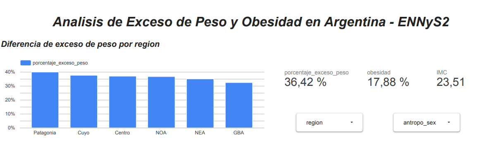
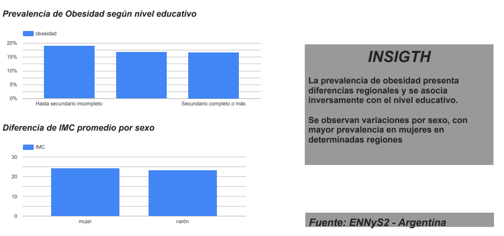
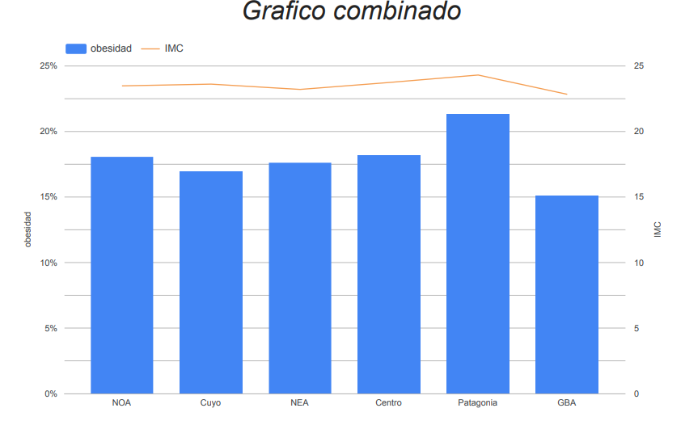

ENNyS2 – Public Health Data Analysis

📊 Proyecto

Este proyecto analiza datos de las Encuesta Nacional de Nutricion y Salud (ENNyS2) con el objetivo de contruir indicadores clave sobre exceso de peso y obesidad en poblaciones adulta de Argentina.
Tiene un enfoque que simula trabajo de Data Analyst Junior, cubriendo:

• Exploracion y limpieza de datos.
• Transformacion y calculo de KPIs.
• Consultas SQL en BigQuery.
• Visualizacion en Looker Studio.

OBJETIVOS
• Calcular prevalencia de exceso de peso y obesidad.
• Analizar diferencias por region.
• Evaluar realcion con nivel educativo.
• Segmentar resultados por sexo.

ESTRUCTURA DEL REPOSITORIO

📂/docs
Contiene documentacion del dataset: diccionario, descrpcion, origen y estructura de datos.

📂/notebooks
• Exploracion inicial.
• Limpieza de datos.
• Contruccion de KPIs.

📂/sql
Consultas utilizadas en BigQuery para:
• Indicadores generales.
• Analisis por sexo.
• Analisis por region.
• Analisis por nivel educativo.

📂/dashboard
El dashboard presenta los principales indicadores de exceso de peso y obesidad en adultos a partir de ENNyS2, utilizando BigQuery como data warehouse y Looker Studio para visualización.

### Exceso de peso por región

### Exceso de peso por nivel educativo y sexo

### IMC promedio y obesidad por región (gráfico combinado)

Dashboard interactivo:  
🔗 https://lookerstudio.google.com/u/0/reporting/1ca27f22-3a85-4df5-9ccc-7b92e4398485/page/j2MpF/edit

README.md
Documeto principal del proyecto.

PROCESO DE TRABAJO
1. Revision del diccionario de datos y comprension de variables antropometricas.
2. Limpieza de valores faltantes y estandarizados de categorias.
3. Contruccion de indicadores:
   • IMC promedio.
   • Porcentaje de exceso de peso.
   • Porcentaje de obesidad.
   
4. Segmentacion por variables sociodemograficas.
5. Visualizacion de resultados en dashboard interactivo.

RESULTADOS PRINCIPALES
• Se observa una prevalencia significativa de exceso de peso en poblacion adulta
• Existen diferencias regionales relevantes
• El nivel educativo muestra asociacion con indicadores de obesidad

Los valores se encuentarn en el dashboard y consultas SQL.

HERRAMIENTAS UTILIZADAS
• Python (Pandas, Numpy).
• SQL (BigQuery).
• Looker Studio.

COMO REPRODUCIR EL PROYECTO
1. Clonar repositorio.
2. Ejecutar los notebooks en orden (exploracion -> limpieza -> KPIs)
3. Ejecutar las consultas SQL en BigQuery
4. Visualizar resultados en el Dashboard

AUTOR

Joaquin Vassellati
• Data Analytics - Salud y Nutricion
   

